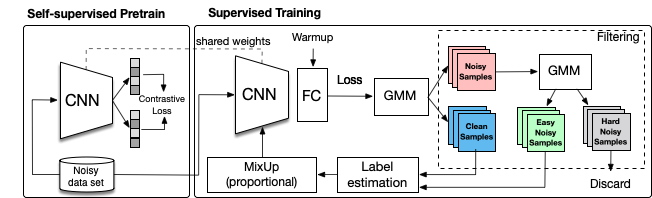

# PropMix: Hard Sample Filtering and Proportional MixUp for Learning with Noisy Labels
This repository is the official implementation of [Hard Sample Filtering and Proportional MixUp for Learning with Noisy Labels](https://arxiv.org/abs/2110.11809) (BMVC 2021).

<b>Authors</b>: Filipe R. Cordeiro; Vasileios Belagiannis, Ian Reid and Gustavo Carneiro


<b>Illustration</b>\


## Requirements
- This codebase is written for `python3`.
- To install necessary python packages, run `pip install -r requirements.txt`.

## Training and Evaluating
The pipeline for training with PropMix is the following:

1. Self-supervised pretrain.

In our paper we use [SimCLR](https://github.com/google-research/simclr) for most of the datasets. We use [moco-v2](https://github.com/facebookresearch/moco) to pre-train an InceptionResNetV2 on Webvision. Other self-supervised methods can be used as well.

If you use SimCLR, run:

`python simclr.py --config_env configs/env.yml --config_exp configs/pretext/<config_file.yml> --cudaid 0`

2. Clustering 

`python scan.py --config_env configs/env.yml --config_exp configs/scan/<config_file.yml> --cudaid 0`

3. Train the model (using the pretraining from steps 1 and 2)

For CIFAR-10/CIFAR-100:

`python propmix.py --r [0.2/0.5/0.8/0.9] --noise_mode [sym/asym] --config_env configs/env.yml --config_exp configs/propmix/<config_file.yml> --cudaid 0` 

Add `--nopt` if you wish to train from scratch, without the self-supervised pretrain, from steps 1 and 2.
Add `--strong_aug` to use strong augmentation. Recommended for high noise rates.


## License and Contributing
- This README is formatted based on [paperswithcode](https://github.com/paperswithcode/releasing-research-code).
- This project is licensed under the terms of the MIT license.
- Feel free to post issues via Github. 

<b>Cite PropMix</b>\
If you find the code useful in your research, please consider citing our paper:

```
@article{cordeiroPropMix2021,
  title={PropMix: Hard Sample Filtering and Proportional MixUp for Learning with Noisy Labels},
  author={Cordeiro, F. R. and Belagiannis, Vasileios and Reid, Ian and Carneiro, Gustavo},
  journal={The 32nd British Machine Vision Conference},
  volume={?},
  year={2021}
}
```
## Contact
Please contact filipe.rolim@ufrpe.br if you have any question on the codes.
